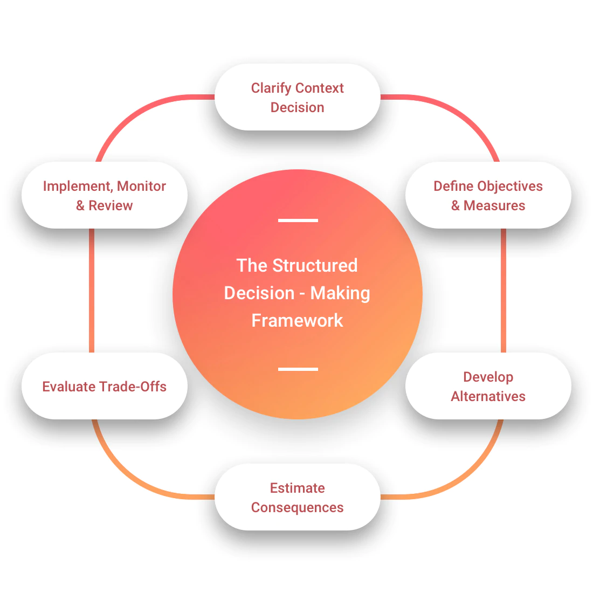

```{r setup, include=FALSE}
knitr::opts_chunk$set(echo = FALSE, cache = FALSE)
library(condensr)
library(dplyr)

staff_csv <- read.csv("staff_list.csv", na.strings = c("NA", "")) %>%
    filter(!is.na(id))

staff_list <- lapply(1:nrow(staff_csv), function(i) {
    staff_member(
        id = staff_csv[i, "id"],
        name = staff_csv[i, "name"],
        description = staff_csv[i, "description"],
        external_link = staff_csv[i, "external_link"],
        internal_link = staff_csv[i, "internal_link"]
    )
})
names(staff_list) <- staff_csv[, "id"]

project_list <- list()

publication_csv <- read.csv("publication_list.csv", na.strings = c("NA", ""))

publication_list <- lapply(1:nrow(publication_csv), function(i) {
    publication(
        title = publication_csv[i, "title"],
        related_staff = stringr::str_split(publication_csv[i, "related_staff"], ",")[[1]],
        link = publication_csv[i, "link"],
        citation = publication_csv[i, "citation"],
        date = as.Date(publication_csv[i, "date"])
    )
})
```


## WHAT WE DO
SPECTRUM's vision is to reduce morbidity and mortality associated with infectious diseases in Australia and our region.

There is a disproportionate burden of infectious diseases in impoverished areas, which persist because of weak health systems and infrastructure. SPECTRUM aims to reduce this burden using sustainable, participatory and model-driven approaches.

SPECTRUM CRE will:

* Produce needed evidence for infectious disease control using models and other quantitative tools.
* Undertake regional risk assessments for emerging diseases like Ebola and COVID-19.
* Frame a proportionate response in the Australian Health Management Pan for Pandemic Influence, including early impact assessment and strategic use of health system resources.
* Promote optimal scheduling of pertussis vaccines on the National Immunisation Program.
* Plan an effective response to the drug-resistant tuberculosis crisis in Daru, Papua New Guinea.
* Identify latent tuberculosis treatment as the most effective measure of tuberculosis control, including in low-income, high incidence countries, leading to international (WHO) policy change.

## HOW WE WORK
SPECTRUM CRE focuses on four key themes in infectious disease prevention and control:

* Endemic infections (scabies)
* Emerging infectious diseases (COVID-19, pandemic influenza)
* Constraining the emergence of and selection for Antimicrobial Resistance (AMR - multidrug resistant tuberculosis)
* Reducing the risk and burden of vector-borne diseases (malaria)

This will be achieved using The Structured Decision-Making Framework: 

